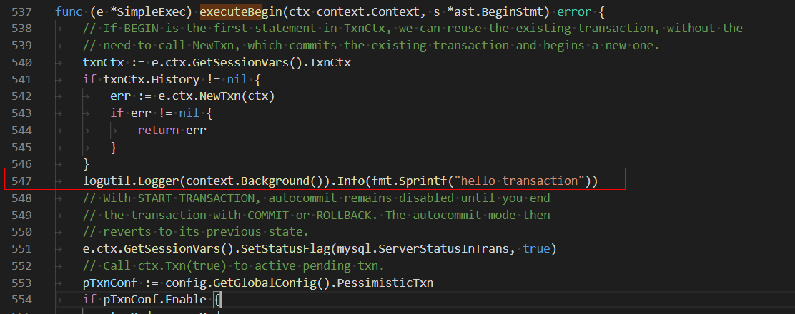
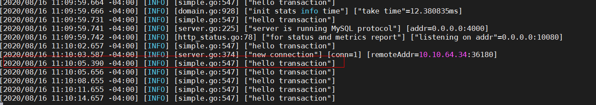

# Lesson 01 Homework

1.下载源码：tidb-server v3.0.17

wget https://github.com/pingcap/tidb/archive/v3.0.17.zip

2.修改代码:TIDB-3.0.17/executor/simple.go executeBegin, 编译(go版本1.14.7)

Line547,添加一行日志:



3.参考官方文档:https://docs.pingcap.com/tidb/stable/quick-start-with-tidb, 使用tiup部署tidb环境，配置文件如下：

```
global:
 user: "tidb"
 ssh_port: 22
 deploy_dir: "/tidb-deploy"
 data_dir: "/tidb-data"

# # Monitored variables are applied to all the machines.
monitored:
 node_exporter_port: 9100
 blackbox_exporter_port: 9115

server_configs:
 tidb:
   log.slow-threshold: 300
 tikv:
   readpool.storage.use-unified-pool: false
   readpool.coprocessor.use-unified-pool: true
 pd:
   replication.enable-placement-rules: true

pd_servers:
 - host: 10.10.64.34

tidb_servers:
 - host: 10.10.64.34

tikv_servers:
 - host: 10.10.64.34
   port: 20160
   status_port: 20180

 - host: 10.10.64.34
   port: 20161
   status_port: 20181

 - host: 10.10.64.34
   port: 20162
   status_port: 20182

```

4.替换/tidb-deploy/tidb-4000/bin/tidb-server为2中编译版本

5.启动tidb: tiup cluster start tidb_test

6.连接tidb，执行begin，观察/tidb-deploy/tidb-4000/log/tidb.log,有 hello transaction输出。

​	*日志中其他hello transaction为框架执行的其他事务打印，符合预期*

